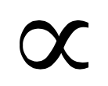

\

# 1. The structure

Contents in `wikiprevia` are currently structured around four main categories:

* *iid Univariate models*, for objective priors for models of the form:
$$
x_i\overset{iid}{\sim} f(x\mid \theta),\,\, x_i\in {\cal R},\,{\boldmath \theta}\in {\cal R}^k.
$$

* *iid Multivariate models*, for objective priors for models of the form:
$$
{\mathbf x}_i\overset{iid}{\sim} f({\mathbf x}\mid{\boldmath \theta}),\,\, {\mathbf x}_i\in {\cal R}^m,\,{\boldmath \theta}\in {\cal R}^k.
$$

* *Structured models*, for objective priors for models with structure (eg. hierarchical or times series).

* *Glossary of terms*, with broadly accesible explanations to the main technical elements in wikiprevia.

The information covered in each of the models is organized on three tabs: `Page` (formal recommendations), `Other` (informal recommendations) and `Discussion` (forum). Depending on the complexity of the model covered, some of these tabs may be essentially empty.

## The tab `Page` (formal recommendations)

For a model, the tab `Page` contains an introductory part with an accurate description of the statistical model, along with an interpretation (if clear) of the parameters. The information about priors is organized in sections that cover the different relevant cases (depending eg. if certain parameters are known). 

Then, for each section, `Page` contain, with the most relevant information summarized in a table:

* An Overall Recommended (OR) objective prior, with properties that endorse this recommendation. Properties here provided are based on formal (mathematical) arguments, like for instance: "The OR is the reference prior for the ...", "The OR is the Jeffreys' prior ... ", "The OR is the right Haar ...", "The OR is admissible ..."). Any other interesting property (eg. is OR proper?) is here provided.

* Conditions under which the posterior distribution is proper.  If feasible an expression for the posterior distribution is given.

* (Optionally) Formal-based alternatives to the OR prior (perhaps for certain popular parameterization).

* (Optionally) Details about how to implement the posterior distribution.

* (Optionally) Proper (vague) versions of the recommended priors.

Bibliographic references are provided explicitly documenting the given properties the sentences.

## The tab `Other` (informal recommendations)

Organized by sections created by contributors, this tab is conceived for other objective assignments of the prior distribution:

* based on less formal arguments but that nonetheless, can be reasonably defended.

* References to papers where certain priors have been succesfully used.

* etc.

## The tab `Discussion` (forum)

This part of the wiki gives the possibility for people to ask (and to reply) questions about a great variety of aspects of interest related with the studied model.

# 2. Users and their rights

## Users

There are, basically, seven types of roles to interact with the wiki:

* `reader`
* `user`
* `confirmed user`
* `author`
* `editor`
* `administrator`
* `bureaucrat`

These roles are conceived to promote discussions and questions, but keeping sensible information (formal recommendations) safe.

### `reader`

Rights: Allowed to view all the contents in wikiprevia.

Who: anyone that accesses the website.

### `user`

Rights: Allowed to participate in `Discussion`, either commenting an existing topic or creating a new topic (eg. to ask questions.)

Who: anyone with an account (no need to introduce email address).

### `confirmed user` (still inactive)

Rights: `user` + allowed to edit contents in `Other` (eg. introducing personal alternatives to formal proposals).

Who: any `user` that has provided guarantees of good usage (eg. through confirmation of email or having acredited several accesses in different days to the webpage).

### `author`

Rights: `confirmed user` + allowed to edit contents in `Page`.

Who: Members of the Objective Bayesian section of ISBA (sending a request to an `administrator').

### `editor`

Rights: `author` +  allowed to create new pages, move pages and revert changes.

Who: Starting team: Jim Berger, Anabel Forte, Gonzalo García-Donato and Jesús Palomo.

### `administrator`

Rights: Administrative staff (like managing accounts, etc).

Who: Gonzalo García-Donato and Jesús Palomo.

### `bureaucrat`

Right: mantainance of the wiki (upgrading software, installing needed plugins, etc).

Who: Gonzalo García-Donato and Jesús Palomo.

# 3. A new entrance

An `author` that wants to add a new model or a new glossary term (or even a new category) should contact an `editor` with a brief proposal. The editor accepts and then creates an empty page with the model and copyes there a template (this has associated a name and a category. For instance "Univariate gamma" in category "iid Univariate models").

The `author` edits the page and adds the relevant contents in tab `page`. Once this is finished, the `editor` creates the tab `other` to allow users to write alternatives.

# 4. Adding content

Technical concepts, directly related to Objective methods,1 º in wikiprevia (like "reference priors" or "Jeffreys independence prior") should be linked to a definition in the category of "Glossary of terms". 

wikiprevia is based on [MediaWiki](www.mediawiki.org) the same software used by [wikipedia](www.wikipedia.org) and to edit content in a page either the `edit source` tab or the (more recommendable) `editor` tab can be used. 

The first gives access to an ascii editor with the source code for the contents there. This code has the conventions in MediaWiki which, in many aspects, recalls LaTeX or markdown. 

The `editor` tab opens a visual editor that is much more easy to use.

* To include a formula, use the Insert>Formula button. The syntax is standard LaTeX.
* To 

